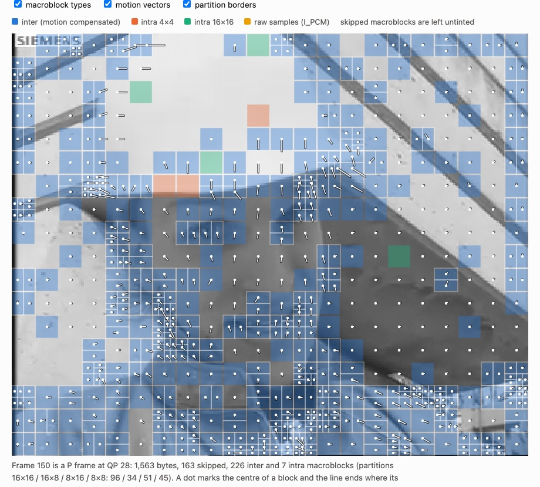
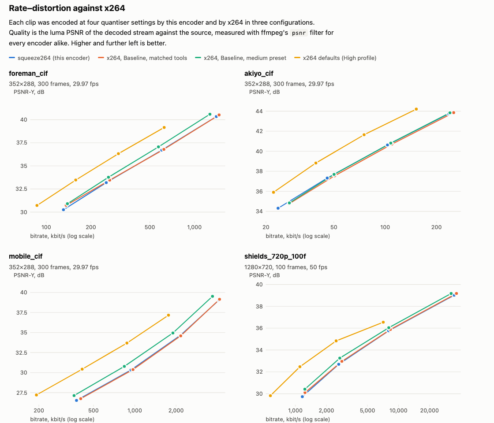

# squeeze264

用 Rust 從零寫的 H.264（AVC）影片編碼器。完全照 ITU-T H.264 規格書的文字實作，沒有用任何第三方套件。
輸入是未壓縮的 Y4M 影片，輸出是 `.mp4`：QuickTime Player 可以直接播放（用它背後的 AVFoundation 框架驗證過），
VLC、ffplay 這類以 libavcodec 為基礎的播放器也可以（用 ffmpeg 驗證過）。

這個專案的重點不只是編碼器本身，而是**證明它是對的**：每一段測試影片壓完之後，交給兩個獨立的解碼器
（ffmpeg 的 libavcodec 和 Apple 的 VideoToolbox）解碼，解出來的每一張畫面都必須和編碼器自己算出來的重建畫面
**位元組完全相同**，而且解碼器不能印出任何警告。

這是照著二十年前的標準重做一次的學習專案，題目參考
[MIT 6.205 2022 年秋季的期末專題「H.264 Video Compression and Transmission」](https://fpga.mit.edu/6205/F25/final_project_archive)，
這裡改用軟體實作。它沒有要跟 x264 競爭；[和 x264 的比較](#和-x264-的比較)會老實寫出輸多少、為什麼輸。
[English README](README.md) · [白話導讀](docs/導讀.zh-TW.md)

```
$ ./target/release/squeeze264 check data/foreman_cif.y4m --qp 28
300 frames 352x288 @ 29.97 fps, level 1.3
bitrate   503.9 kbit/s (630544 bytes)
PSNR      Y 35.99  U 40.52  V 41.92 dB
macroblocks  I4x4 2.2%  I16x16 1.1%  inter 59.7%  skip 37.0%
speed     106.0 fps (2.83 s)
PASS  ffmpeg (libavcodec h264)                   Annex B  300/300 frames identical, decoder silent
PASS  ffmpeg (libavcodec h264)                   MP4      300/300 frames identical, decoder silent
PASS  Apple VideoToolbox (via ffmpeg hwaccel)    Annex B  300/300 frames identical, decoder silent
PASS  Apple VideoToolbox (via ffmpeg hwaccel)    MP4      300/300 frames identical, decoder silent
bit-exact: the decoders reproduce the encoder's reconstruction exactly
```

45 MB 的原始影片壓成 0.6 MB。下面這張圖是那次編碼的第 150 張畫面，上面畫出編碼器的決定：
藍色方塊是從上一張畫面預測來的（線條是移動向量、小格子是切分方式），橘色和綠色是畫面內編碼，沒上色的是直接跳過的方塊。



完整報告（每張畫面的統計、滑鼠移到方塊上可以看細節）在 [`docs/results.html`](docs/results.html)，下載後用瀏覽器打開。

## 實作了什麼

Constrained Baseline profile，全部是真的實作，沒有假的或空殼：

| 部分 | 內容 |
|---|---|
| 輸入 | Y4M、4:2:0、8-bit，一張一張讀（不會整個檔案載入記憶體）。寬高只要是偶數；不是 16 的倍數會自動補邊，再用 SPS 的裁切欄位還原。 |
| 畫面類型 | I（IDR）和 P，一張參考畫面，每張畫面一個 slice。 |
| 畫面內預測 | 16×16（4 種模式）、4×4（9 種模式）、色度（4 種模式），用 SATD 選模式。超過大小限制時改用 I_PCM。 |
| 畫面間預測 | 16×16、16×8、8×16、8×8，以及 8×4／4×8／4×4 切分；P_Skip；移動向量預測；向量可以指到畫面外。 |
| 移動估計 | 鄰居候選、六角形搜尋、半像素和四分之一像素微調。亮度 6-tap 內插、色度八分之一像素雙線性內插。 |
| 殘差 | 4×4 整數轉換、Intra16×16 和色度 DC 的 Hadamard 轉換、量化、CAVLC（全部的表）。 |
| 迴路濾波 | 去方塊濾波，所有邊界強度、alpha/beta 偏移。 |
| 位元率控制 | 固定 QP，或指定平均位元率（單次編碼）。 |
| 輸出 | SPS／PPS／slice header（含 VUI 時間資訊）、Annex B 位元流，以及自己寫的 MP4 封裝。 |
| 工具 | 有進度和每張畫面統計的命令列、HTML 報告、和 x264 的比較腳本。 |

`src/` 約 8,200 行 Rust（含單元測試），`tests/` 約 1,100 行。

## 快速開始

需要 Rust（stable）。`ffmpeg` 只有驗證時需要，`x264` 只有跑比較時需要。

```sh
make build        # cargo build --release
make test         # 114 個測試；一致性測試需要 PATH 裡有 ffmpeg
make data         # 下載標準測試影片（約 275 MB，會檢查 SHA-256）
./target/release/squeeze264 encode data/foreman_cif.y4m -o foreman.mp4 --qp 28
open foreman.mp4
```

在 Mac 上直接雙擊 `跑跑看.command` 就會全部做完：編譯、下載一段影片（沒有網路就自己產生合成畫面）、
壓縮、找解碼器驗證、產生報告，最後打開影片和報告。

```
squeeze264 encode <in.y4m> -o <out.mp4|out.h264> [--qp N | --bitrate KBPS] [--keyint N] ...
squeeze264 check  <in.y4m> [同樣的選項]        壓縮後用 ffmpeg 和 VideoToolbox 解碼並比對
squeeze264 gen    <out.y4m> [--size WxH] [--frames N] [--pattern moving|noise|still|extremes]
squeeze264 --help                             所有選項
```

## 運作方式

```
 原始畫面 ─► 每個方塊：做決定 ─► 預測 ─► 殘差 ─► 轉換＋量化 ─► CAVLC ─► 位元流
                 ▲          (畫面內／畫面間)            │
                 │                              反量化＋反轉換
                 │                                      ▼
             參考畫面 ◄─ 半像素平面 ◄─ 去方塊濾波 ◄─ 重建畫面
```

下面那一圈其實就是一個完整的解碼器：每一張畫面是拿「解碼器手上會有的畫面」來預測，而不是拿原始畫面。
測試比對的就是這個重建畫面。架構、困難的地方（抄表、鄰居可用性、精確的內插、QP 的繼承、level 限制）
和沒有採用的作法都寫在 [`docs/DESIGN.md`](docs/DESIGN.md)。

## 驗證

以下都可以用列出的指令重現。結果是在 Apple M5、macOS 27、ffmpeg 8.0.1 上跑的。
「VideoToolbox」是指 ffmpeg 的 `-hwaccel videotoolbox`，並且強制使用硬體的畫面格式，所以不可能偷偷退回軟體解碼。

**1. 真實影片逐位元比對** — `make check`

每段影片 ×｛QP 22、QP 37、目標 800 kbit/s｝×｛ffmpeg 軟體解碼、VideoToolbox｝×｛Annex B、MP4｝：

| 影片 | 張數 | 結果 |
|---|---|---|
| foreman CIF | 300 | 12/12 次完全相同，解碼器沒有任何訊息 |
| akiyo CIF | 300 | 12/12 |
| mobile CIF | 300 | 12/12 |
| shields 720p50（前 100 張） | 100 | 12/12 |

**2. 亂數決定的模糊測試** — `cargo test --release --test conformance fuzz`

把編碼器的決定換成亂數（但合法）的選擇：方塊類型、預測模式、切分方式、允許範圍內任意的移動向量、
coded_block_pattern、三分之一的方塊改 QP、I_PCM。內容包含雜訊、合成的移動畫面、極端黑白。
28 個亂數種子，尺寸從 16×16 到 176×144，QP 0 到 51，濾波開與關、alpha 偏移 −6 到 +6、色度 QP 偏移 −12 到 +12。
每一段都必須逐位元一致。測試還會確認這批資料用到了 coeff_token 表的全部 262 項、畫面內和畫面間各 48 種
coded_block_pattern、每一種預測模式和切分、全部 16 種次像素位置，以及 QP 的兩個極端。
另外有 6 個種子用 320×240 跑 VideoToolbox。

**3. 對照規格的單元測試** — `cargo test --release --lib`（86 個）

Exp-Golomb 對照規格表 9-2；CAVLC 表檢查前綴性質和精確的 Kraft 和，並用另外寫的測試專用解碼器來回驗證
（6 萬個亂數區塊）加上兩個文獻裡的範例；反轉換對照 8.5.12 的公式；52 個 QP 的量化來回誤差上限；
16 種四分之一像素位置對照另一份逐點照 8.4.2.2 寫的實作；畫面內預測的手算例子；
去方塊濾波的輸出和邊界強度的手算例子；移動向量預測（含子切分的可用性）；MP4 box 結構；MD5 對照 RFC 1321。

**4. 第三條解碼路徑和容器格式** — `make avcheck`（macOS）

`tools/avcheck.swift` 用 AVFoundation（QuickTime Player 用的框架）打開 MP4：

```
playable=true size=352x288 fps=29.970 duration=10.010 frames=300 reader=completed
AVFoundation decoded 300 frames; 300/300 identical to the encoder's reconstruction
```

**5. 任何人都可以自己動手比對**

```sh
./target/release/squeeze264 encode data/foreman_cif.y4m -o out.h264 --framemd5 out.md5
ffmpeg -v error -i out.h264 -f framemd5 - | grep -v '^#' | awk '{print $6}' | diff - out.md5 && echo identical
```

**6. 測試真的抓得到錯嗎？** — `python3 tools/mutants.py`

在會影響解碼結果的程式裡故意放 22 個一行的錯（表格對調、四捨五入常數、鄰居規則），22 個全部被測試抓到
（[`docs/mutants.md`](docs/mutants.md)）。第一次跑的時候只抓到 21 個；漏掉的那個（frame_num 在錯的數值歸零，
解碼器會默默容忍）暴露了「靠解碼器當裁判」看不到的盲點，所以後來加了直接檢查 slice header 的測試。

解碼器不會抱怨的規定則直接測試：每個方塊 3200 位元的上限（I_PCM 後備）、各 level 的向量範圍、
level 3.1 以上的移動向量數量限制、frame_num 編號、level 的選擇。

## 和 x264 的比較

`make bench` 對每段影片用四種量化設定，分別以 squeeze264 和三種設定的 x264 0.165 編碼，
再用 ffmpeg 量每一個解碼結果相對原始影片的亮度 PSNR 和 SSIM。
BD-rate 是「同樣 PSNR 下 squeeze264 平均要多用多少位元率」（正數代表比較差）。

| 影片 | 對 x264（功能對齊） | 對 x264 Baseline、medium 預設 | 對 x264 預設值（High profile） |
|---|---|---|---|
| foreman CIF | +0.5 % | +13.1 % | +74.0 % |
| akiyo CIF | −4.2 % | −0.5 % | +69.2 % |
| mobile CIF | −1.4 % | +20.8 % | +115.4 % |
| shields 720p | +1.6 % | +14.2 % | +111.9 % |



- **功能對齊**：把 x264 限制成這個編碼器有的功能——Baseline、一張參考畫面、六角形搜尋、用 SATD 做決定、
  不做 RD 最佳化和 trellis（`--subme 5 --trellis 0 --ref 1`）。這時兩者相差只有幾個百分點。
- **Baseline、medium 預設**：讓 x264 在 Baseline 範圍內用它的 RD 最佳化模式選擇、trellis 量化和三張參考畫面。
  這些值 0–21 % 的位元率，是這個編碼器沒有的。
- **預設值**：再加上 CABAC、B 畫面、8×8 轉換和 macroblock-tree（High profile）。
  同樣的 PSNR，這個編碼器大約要 1.7 到 2.2 倍的位元率。這些就是「未來工作」列的項目。

**速度**（單執行緒、同一台機器、量測時機器上還有其他工作在跑、含程式啟動時間）：

| 影片，QP 27 | squeeze264 | x264 功能對齊 | x264 Baseline medium | x264 預設值 |
|---|---|---|---|---|
| foreman CIF | 82 fps | 793 fps | 409 fps | 381 fps |
| akiyo CIF | 333 fps | 2313 fps | 1170 fps | 1044 fps |
| mobile CIF | 64 fps | 755 fps | 197 fps | 300 fps |
| shields 720p | 23 fps | 93 fps | 42 fps | 59 fps |

x264 快好幾倍（跟功能對齊的設定比大約 4 到 12 倍）：它每個核心運算都有手寫的 SIMD，這個編碼器是純 Rust、沒有 SIMD。
速度會隨 QP 變化（720p 是 13–54 fps，CIF 是 57–843 fps）；全部量測值在 [`docs/bench.json`](docs/bench.json) 和報告最下面的表格。

位元率模式在測試影片上和目標相差 7 % 以內（foreman 目標 300 和 800 kbit/s：實際 315 和 818；
akiyo 目標 100：104；mobile 目標 1500：1525；shields 720p 目標 4000：4276，只有 100 張）。

## 限制

- 只有 Baseline 的工具：沒有 B 畫面、CABAC、8×8 轉換、交錯式、加權預測；只有一張參考畫面、每張畫面一個 slice。
  沒有多執行緒，沒有 SIMD。
- 模式選擇用 SATD 估計，不是真正的 RD 成本；沒有 trellis 量化、自適應量化、心理視覺最佳化、
  預看和場景切換偵測（GOP 中間換場景時，會編成一張充滿畫面內方塊的 P 畫面）。
- level 是依畫面大小和張率決定的（位元率模式會再考慮目標位元率）。固定 QP 模式事先不知道位元率，
  有可能超過該 level 的上限：shields 720p50 在 QP 22 時是 34.7 Mbit/s，而 level 3.2 的上限是 20 Mbit/s。
  沒有保證 HRD/CPB 和最小壓縮比。這裡用的解碼器不會檢查這些。
- 位元率控制是以整張畫面為單位、單次編碼，沒有緩衝區模型，短片可能超出目標。
- 輸入必須是 8-bit 4:2:0 的 Y4M、寬高為偶數。輸入的像素長寬比會被忽略（當成正方形像素），色彩資訊也不會帶過去。
- VideoToolbox 在這台機器上拒絕小於 64×64 的畫面（32×32 和 64×48 都被拒絕），這種尺寸只用 ffmpeg 軟體解碼驗證
  （`check` 會顯示 SKIP）。硬體解碼的比對需要 macOS；Linux 上只用 ffmpeg。
- MP4 封裝只寫一條固定張率的視訊軌，索引放在檔案最後（本機播放沒問題，不適合邊下載邊播）。
- 一致性是用解碼器驗證的，沒有用官方的 JVT conformance 位元流（那是測解碼器用的），也沒有用位元流分析器。

未來工作，依效益排序：RD 最佳化的模式選擇、多張參考畫面、CABAC、B 畫面、8×8 轉換（High profile）、SIMD、slice 層級的多執行緒。

## 相關作品

- **[x264](https://www.videolan.org/developers/x264.html)**：產品等級的開源 H.264 編碼器，也是上面比較的基準。
  squeeze264 只實作了它一小部分的功能，而且慢很多。
- **[OpenH264](https://www.openh264.org/)**（Cisco）：即時的 Constrained Baseline 編解碼器，瀏覽器的 WebRTC 在用。
- **JM**：Joint Video Team 的參考軟體，是標準的參考實作。
- **[minih264](https://github.com/lieff/minih264)**（lieff）：精簡的單一標頭檔 C 編碼器，有 SIMD，給嵌入式用途；
  精神上最接近，而且實用得多。
- **[hello264](https://www.cardinalpeak.com/blog/worlds-smallest-h-264-encoder)**（「世界上最小的 H.264 編碼器」，Ben Mesander）
  和 Jordi Cenzano 的[極簡編碼器](https://jordicenzano.name/2014/08/31/the-source-code-of-a-minimal-h264-encoder-c/)：
  只寫出未壓縮的 I_PCM 方塊——位元流合法，但沒有壓縮。
- 啟發這個專案的 MIT 6.205 專題是在 FPGA 上實作 H.264 的基本元件。

這個專案沒有宣稱任何新穎性。它是從零寫的教學用實作：沒有取用上面任何專案的程式碼，
是照 ITU-T 建議書（可在 itu.int 免費下載）和教科書的描述寫的，解碼器只被當成黑盒子裁判。
它多做的是：示範怎麼**證明**這樣的編碼器是正確的，並且老實量出每一個沒做的功能值多少。

## 目錄結構

```
src/            編碼器函式庫和命令列（模組說明見 docs/DESIGN.md）
tests/          一致性測試（需要 ffmpeg）、編碼器行為、命令列
tools/          bench.py、report.py、mutants.py、fetch_data.py、avcheck.swift / avcheck.sh
docs/           DESIGN.md、導讀.zh-TW.md、results.html、bench.json、mutants.md
跑跑看.command   雙擊就能跑的示範（macOS）
data/           測試影片（不在 git 裡；用 make data 下載）
```

`make` 目標：`build`、`test`、`test-debug`（同樣的測試但打開 debug 檢查）、`lint`、`data`、`check`、
`bench`、`report`、`avcheck`、`demo`、`clean`。CI 會在 Linux（用 apt 裝 ffmpeg、測試時產生合成畫面）和 macOS 上編譯並跑測試。

## 專利與授權

H.264 在許多國家受專利保護。這個儲存庫是教學用的原始碼，不提供任何專利授權。
原始碼以 [MIT 授權](LICENSE) 釋出。測試影片來自 [Xiph.org 的測試影片集](https://media.xiph.org/video/derf/)，是下載取得、沒有隨儲存庫散布。
